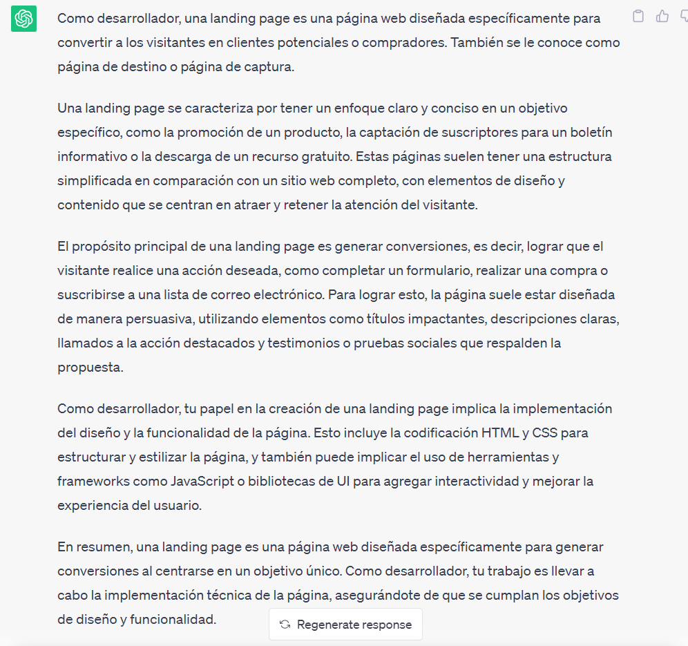

..
  Copyright (c) 2025 Allan Avendaño Sudario
  Licensed under Creative Commons Attribution-ShareAlike 4.0 International License
  SPDX-License-Identifier: CC-BY-SA-4.0

========================================================
Proyecto 03: Landing Page SPA - TailwindCSS & Javascript
========================================================

.. topic:: Objetivo general
    :class: objetivo

    Desarrollar una página de destino (landing page) de una sola página (SPA) utilizando TailwindCSS y Javascript que permita presentar información de manera atractiva y funcional aplicando principios de diseño responsivo, accesibilidad y usabilidad, así como la integración de interactividad mediante Javascript para mejorar la experiencia del usuario.

Introducción
======================

.. admonition:: Prompt

    Como desarrollador, explica ¿Qué es una landing page?

.. toctree::
  :maxdepth: 1
  :caption: Guías
  
  ../guias/guia06.rst
