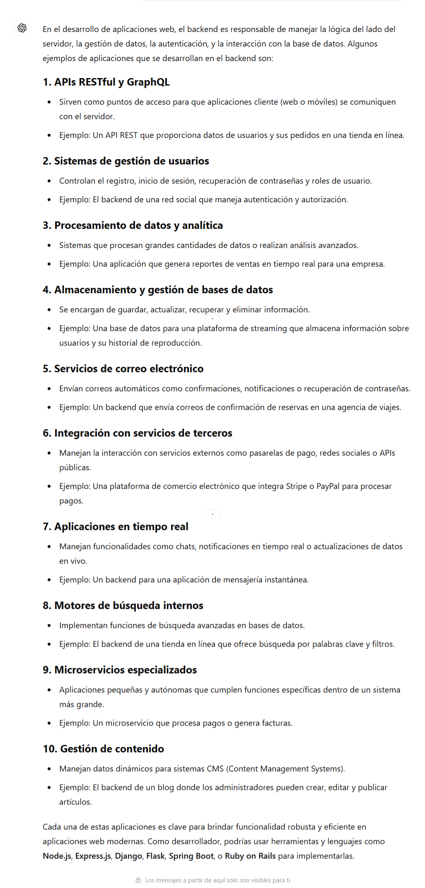
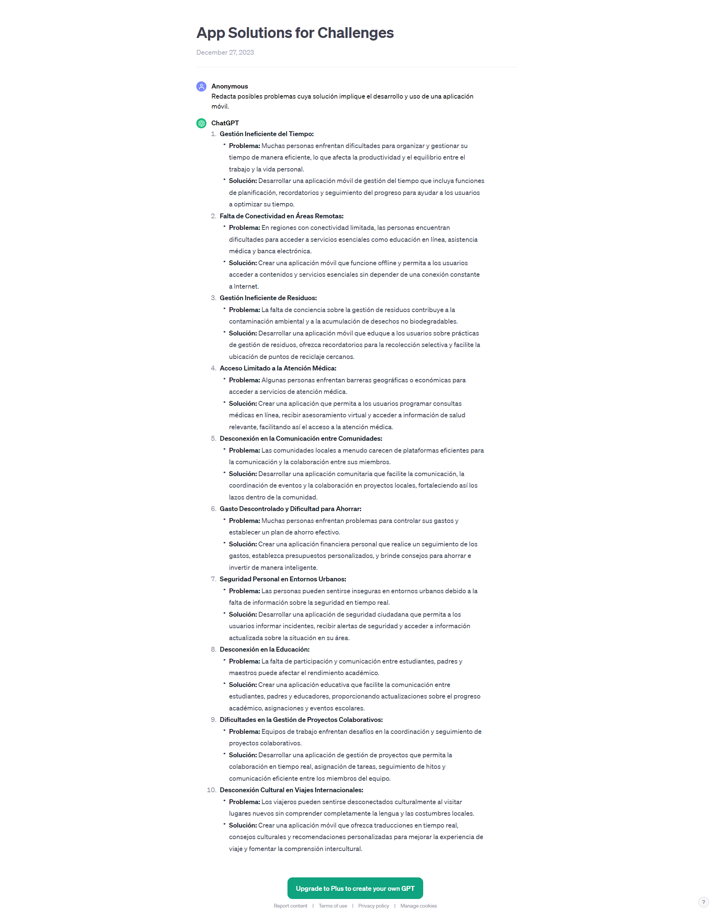

..
  Copyright (c) 2025 Allan Avendaño Sudario
  Licensed under Creative Commons Attribution-ShareAlike 4.0 International License
  SPDX-License-Identifier: CC-BY-SA-4.0
  
===============================================
Proyecto 05: Aplicación Híbrida - React y Ionic
===============================================

.. topic:: Objetivo general
    :class: objetivo

    Desarrollar una aplicación móvil utilizando React Native.

Introducción
======================

.. admonition:: Prompt

    Como desarrollador de aplicaciones móviles, explica los pasos del proceso para crear una aplicación móvil.

.. admonition:: Prompt
    
    Redacta posibles problemas cuya solución implique el desarrollo y uso de una aplicación móvil.

.. toctree::
  :maxdepth: 1
  :caption: Guías
  
  ../guias/guia17.rst
  ../guias/guia18.rst
  ../guias/guia19.rst
  ../guias/guia20.rst